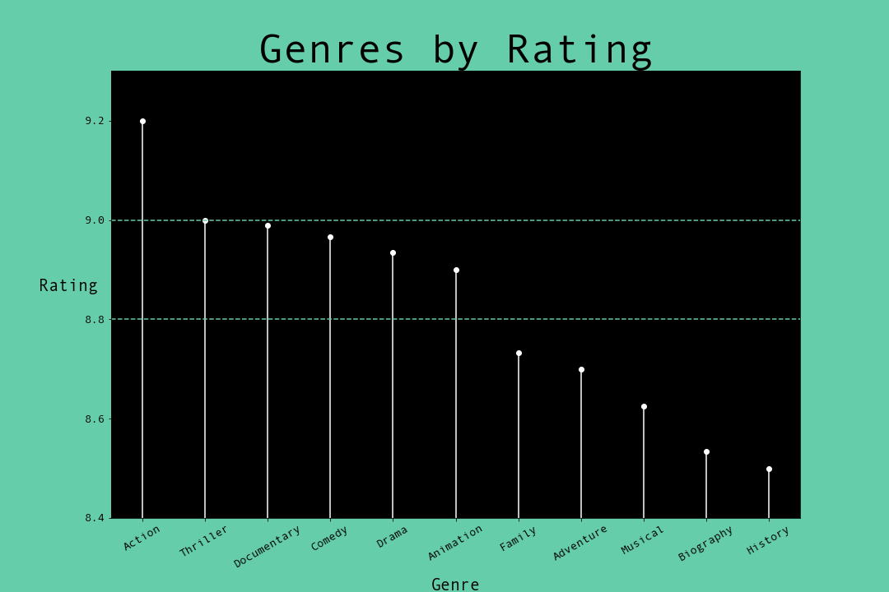
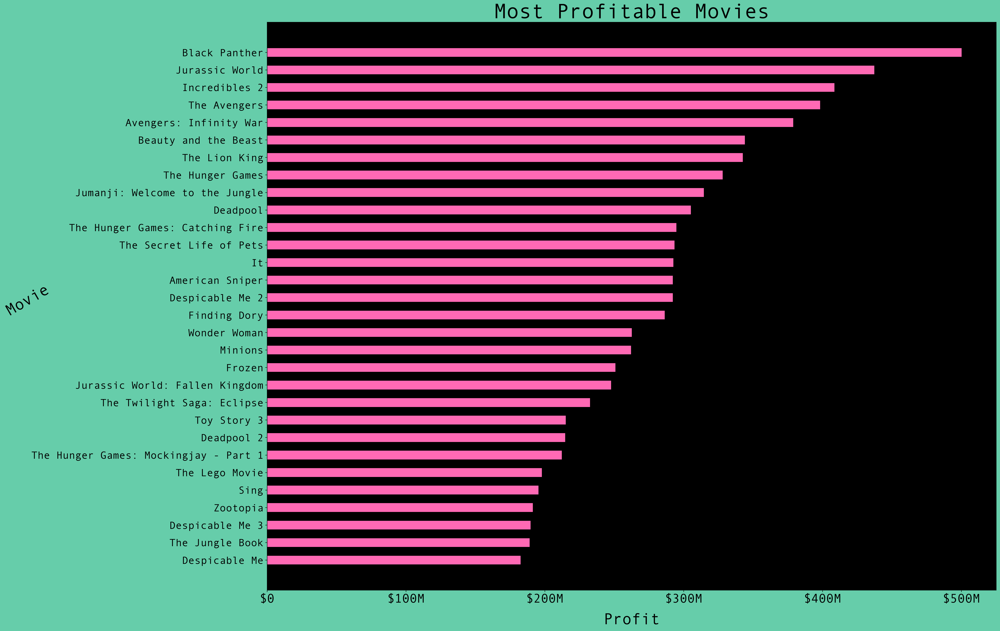
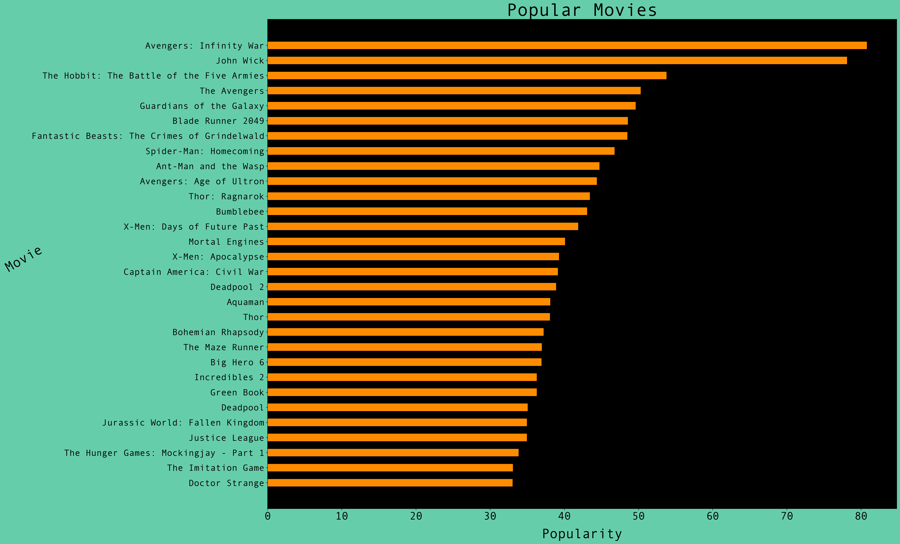
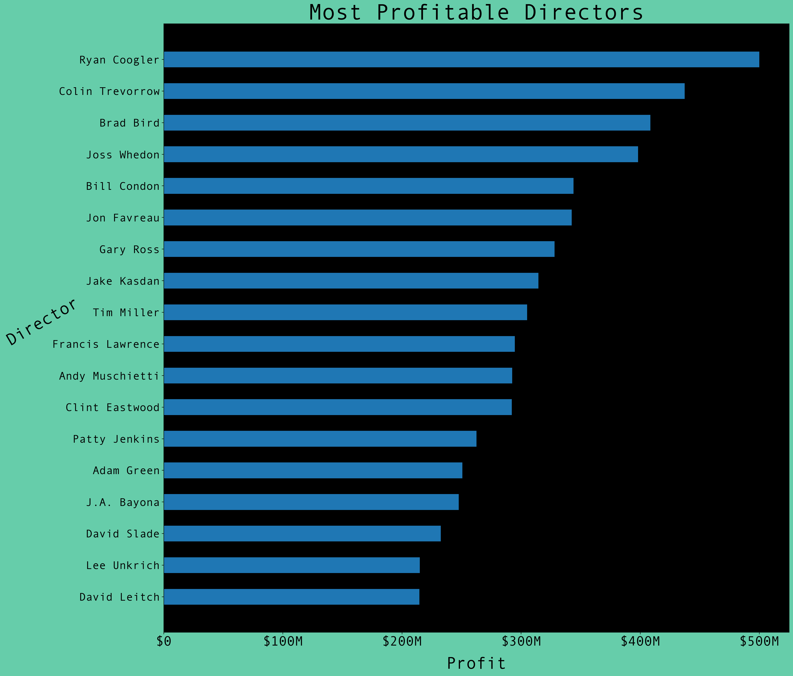
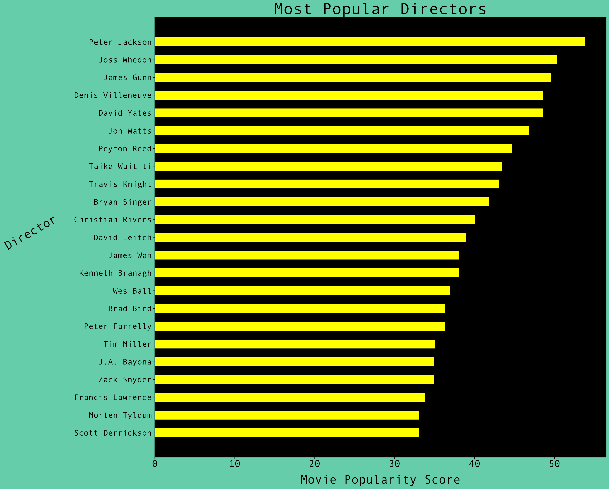
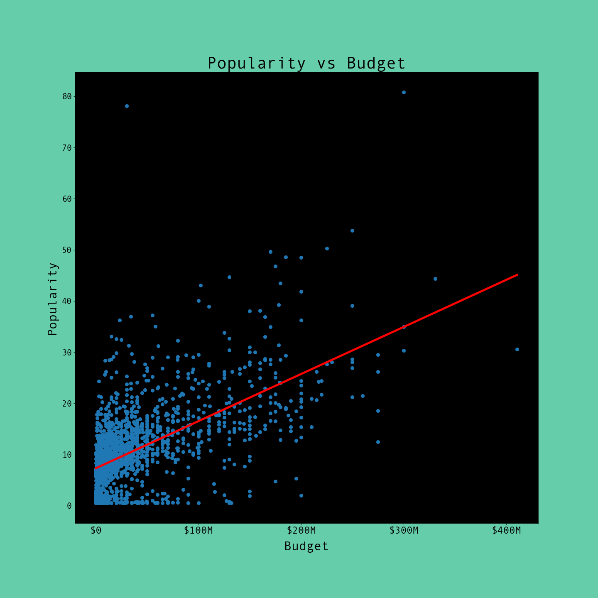

# **Movie Industry Analysis**
### Client  :  Microsoft
> *Authored by: Patrick Anastasio*

## Introduction

In preparation of entering the movie production business, Microsoft has asked me to prepare an analysis of current movie trends and to generate suggestions as to where to invest capital and how they can be sussesful in producing profitable movies. I will be analysing several datasets and making inferences off of financial information, ratings and popularity scores, as well as looking at established industry professionals to make suggestions on what genres and types of films to invest in and who to attach to projects to create buzz and generate an audience.


## Business Problem

Movies are a 'risky business.' As a fledgling production house, Microsoft is unsure as to what kinds of movies to make, and where to invest capital. They lack the experience and industry knowledge that many of the top studios possess. Several factors go into producing a succesful movie. There are a few over-arching features that we will focus on: (1) gross revenue of the top rated and top grossing movies of the modern film era, (2) popular and highly rated genres, and (3) industry professionals who were instrumental in creating these movies.

## The Data

I have pulled in multiple datasets from three industry standard data aggregation sites.
- [Internet Movie Database (IMDB)](https://www.imdb.com/)
- [The Movie Database (TMDB)](https://www.themoviedb.org/?language=en-US)
- [The Numbers](https://www.the-numbers.com/)

My subsequent filtering and analysis of these datasets focused on the following metrics:
> - Financials: 
>    - Budget and Domestic Gross Revenue
> - Ratings and Popularity Scores
> - Movie Genres
> - Names of directors

## The Method

After merging the datasets of interest I narrowed the scope of my analysis by initially filtering the data to only include movies made from 2010 forward. This constitutes the modern era of movie-making, and is characterized by new technologies, an explosion of investment and bigger budgets.

I then converted data types as needed to allow me to operate on them. Specifically, converting objects to numbers to allow me to work with them mathematically.

From these merged and cleaned datasets I pulled dataframes based on:
>1. ratings and popularity scores across all movies and averaged these into specific genres  
>2. domestic gross revenue across all movies, and then honing in on the top thirty (30) grossing movies and their budgets  
>3. directors of the top thirty (30) grossing movies, as well as writers and actors.

## Results
Filtering the data on a minimum number of votes and a minimum rating threshold, my analysis shows the highest rated genres by average movie rating are:
    
  > - **Action** is the top genre by a large margin 

  > - Other genres with high ratings are:
        - Thriller
        - Documentary
        - Comedy
        - Drama
        - Animation
        


Looking at the gross profit of the top 30 movies of the modern era, my analysis shows the following:

   > - 15 were in the animation or computer-generated graphic genre, with many being franchises as well

   > - 13 were in the action genre:
        - All but 1 of those was part of a franchise, or connected series of movies
        - 6 were super-hero / comic book movies, and alll part of a franchise
        


Further, looking at the popularity scores of the top 30 most popular movies of the modern era, my analysis shows the following:

   > - 22 were in the action genre, 19 were part of a franchise
        - 16 of these were super-hero / comic book franchises
        
   > - 3 were animation

   > - 3 were drama

   > - 2 were fantasy/adventure franchises



We also looked at who the directors were on the most profitable and the most popular movies, with some directors appearing multiple times in these lists.





## In Conclusion
Based on these observations, there are three reccomendations that I will put forth.

#### 1.  Microsoft should acquire the rights to a super-hero / comic book franchise, or possibly another type of action franchise
>- The most popular and profitable genre overall is action.  
>- The most successful movies by both profitability and popularity were in the superhero / comic book sub-genre.  
>- All were franchises

#### 2.  Microsoft should produce animated movies
>- 15 of the top 30 most profitable were animation

#### 3.  Microsoft should attach top grossing and popular directors
>- Directors are the leaders on set and they can make or break a project. You want a proven and experienced director at the helm.  
>- They bring buzz and notoriety, as well as attract top talent and collaborative investment to their projects

## Further Considerations

I would consider looking at the budgets of popular movies. We saw a slight positive correlation between budget and popularity. This could be a function of an increase in marketing budget, pay scales of top talent, or something else. This could prove to be a worthwhile anaysis of where to allocate capital in a budget, and whether certain escalations could pay dividends for the bottmline.




#### Thank You!

Email: sudomakecoffee1@gmail.com  

GitHub: [@patrick-anastasio](https://github.com/patrick-anastasio)

LinkedIn: [patrickanastasio](linkedin.com/in/patrickanastasio/)


```
├── README.md                        <- The top-level README for reviewers of this project
├── microsoft_movie_analysis.ipynb   <- Narrative documentation of analysis in Jupyter notebook
├── presentation.pdf                 <- PDF version of project presentation
├── movie_analysis_notebook.pdf      <- PDF version of Jupyter notebook
├── data                             <- Both sourced externally and generated from code
└── images                           <- Both sourced externally and generated from code
```